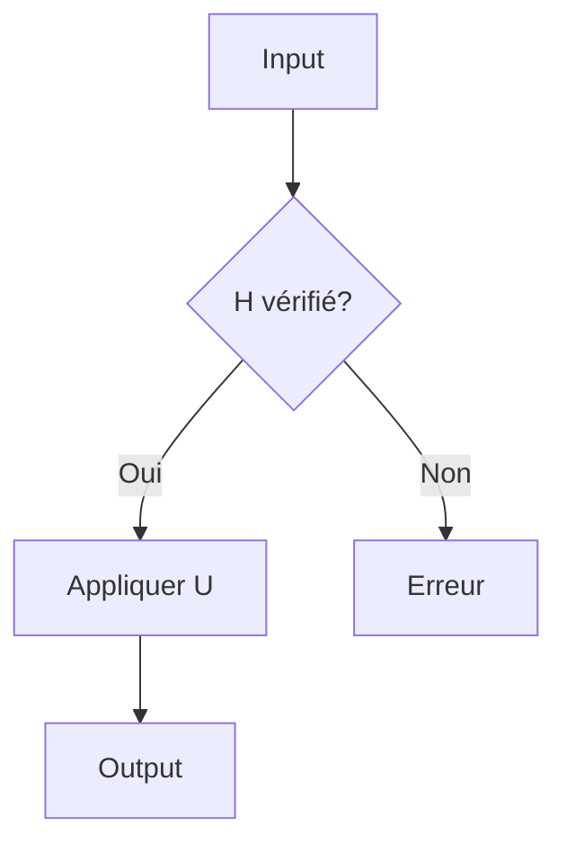

# Diagrammes pour le calcul quantique

Ce dossier contient les scripts Python pour générer les figures et schémas
illustrant les concepts du cours **Quantum Computing Engineering**.

## Installation

Les dépendances sont dans `requirements.txt` à la racine. Les principales :

- `matplotlib >= 3.8`
- `numpy >= 1.26`
- `scipy >= 1.12`

## Utilisation

### Générer tous les diagrammes

```bash
cd code/diagrams
python diagrams.py
```

Les fichiers PNG sont sauvegardés dans `../../figures/`.

### Générer un diagramme spécifique

```bash
python diagrams.py bloch_sphere
python diagrams.py bell_states_grid
python diagrams.py surface_code_grid
```

## Liste des diagrammes disponibles

| Fonction | Description | Chapitre lié |
|----------|-------------|--------------|
| `bloch_sphere` | Sphère de Bloch 3D avec axes et états de base | 1.1, 2.1, 3.1 |
| `bloch_trajectory` | Oscillation de Rabi sur la sphère de Bloch | 2.1, 3.1 |
| `bell_states_grid` | Les 4 états de Bell en barres de probabilité | 2.2, 4.1 |
| `chsh_correlations` | Test de CHSH : classique vs quantique | 2.2 |
| `circuit_diagram` | Exemple de circuit quantique 3 qubits | 3.1, 3.2 |
| `surface_code_grid` | Code de surface de distance d=3 | 10.1 |
| `qft_circuit_diagram` | Circuit QFT pour n=4 qubits | 6.1 |
| `grover_iteration` | Une itération de Grover (Oracle + Diffuseur) | 8.1 |
| `decoherence_curve` | Courbes T1 et T2 de décohérence | 4.2, 12.1 |

## Diagrammes ASCII (Mermaid)

Pour les diagrammes inclus directement dans les fichiers `.md`, on utilise
la syntaxe **Mermaid** supportée nativement par GitHub :

### Exemple : circuit quantique

```mermaid
graph LR
    q0[|q_0⟩] --> H[H] --> X[X] --> M1[M]
    q1[|q_1⟩] --> H2[H] --> CX[•] --> M2[M]
    CX -.-> X
```

### Exemple : graphe d'algorithme



## Ajout de nouveaux diagrammes

Pour ajouter un nouveau diagramme, ajouter une fonction dans `diagrams.py`
suivant ce modèle :

```python
def mon_diagramme(filename="mon_diagramme.png"):
    """Description du diagramme."""
    fig, ax = plt.subplots(figsize=(8, 5))
    # ... votre code matplotlib ...
    out_path = os.path.join(OUTPUT_DIR, filename)
    plt.savefig(out_path, dpi=120, bbox_inches='tight')
    plt.close()
    print(f"✓ Sauvegardé : {out_path}")
```

Puis l'ajouter à la liste dans `all_diagrams()`.

## Voir aussi

- [Mermaid documentation](https://mermaid.js.org/) — pour les diagrammes
  dans les fichiers `.md`
- [Qiskit visualizations](https://qiskit.org/documentation/tutorials/circuits/3_visualization.html)
  — alternatives spécifiques au calcul quantique
