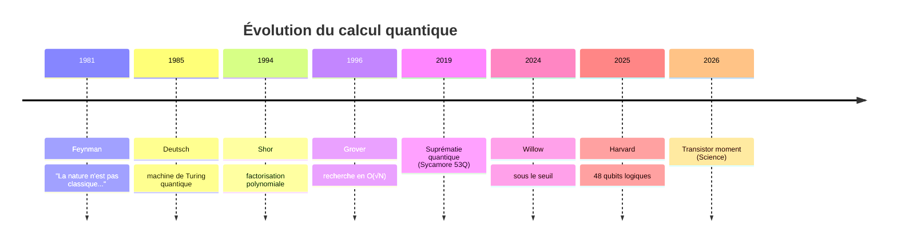

# Chapitre 1.1 — Introduction historique et panorama

## Ce que vous allez apprendre

- Comprendre pourquoi le calcul quantique est né et quel problème il résout
- Situer les grandes dates qui ont façonné le domaine (1981–2026)
- Saisir le lien profond entre physique et information
- Connaître les accélérations quantiques pour des problèmes concrets
- Avoir une vision claire de l'état de l'art actuel (processeurs, correction d'erreur)

---

## Motivation

Imaginez que vous devez trouver les facteurs premiers d'un nombre de 2000 chiffres. Le meilleur algorithme classique mettrait plus de temps que l'âge de l'univers. Pourtant, un ordinateur quantique pourrait le faire en quelques heures. Ce n'est pas de la science-fiction : c'est l'algorithme de Shor (1994), et les premiers processeurs capables de l'exécuter sont en développement actif.

Le calcul quantique ne se contente pas d'aller « plus vite » : il change fondamentalement la nature du calcul. Là où un ordinateur classique manipule des bits (0 ou 1), un ordinateur quantique exploite les lois de la mécanique quantique — superposition, intrication, interférence — pour traiter l'information d'une manière radicalement nouvelle.

Dans ce chapitre introductif, nous allons poser le décor : d'où vient cette idée, pourquoi elle est profonde, et où nous en sommes aujourd'hui. Ce chapitre ne nécessite aucun prérequis mathématique — il s'agit de comprendre le « pourquoi » avant d'attaquer le « comment » dans les chapitres suivants.

---

## Idée principale

Pensez à un labyrinthe. Un ordinateur classique est comme une souris qui explore chaque chemin un par un, jusqu'à trouver la sortie. Un ordinateur quantique, lui, c'est comme si vous pouviez verser de l'eau dans le labyrinthe : l'eau explore **tous les chemins en même temps**, et c'est le chemin le plus court qui émerge naturellement.

Bien sûr, la réalité est plus nuancée (on ne peut pas simplement « lire » tous les chemins), mais l'intuition est là : le quantique exploite le **parallélisme des amplitudes** pour explorer un espace de solutions exponentiellement grand, puis utilise l'**interférence** pour amplifier la bonne réponse.

---

## Contenu du cours

### Section 1 : Du calcul classique au calcul quantique

#### Le calcul classique et ses limites

Une machine de Turing manipule des **bits** : des états $0$ ou $1$. Tout calcul classique se ramène à des opérations élémentaires sur ces bits via des portes logiques (ET, OU, NON).

**Limite fondamentale :** Pour certains problèmes (factorisation, simulation quantique), le temps de calcul croît exponentiellement avec la taille de l'entrée. Par exemple, factoriser un entier $N$ avec les meilleurs algorithmes classiques demande un temps qui croît comme :

$$O(e^{1.9 (\log N)^{1/3} (\log \log N)^{2/3}})$$

> **Intuition :** Cette formule signifie que si vous ajoutez quelques chiffres à $N$, le temps de calcul explose. C'est exactement ce qui rend la cryptographie RSA sécurisée aujourd'hui — mais vulnérable à un ordinateur quantique.

#### La naissance de l'idée quantique

L'idée d'utiliser la mécanique quantique pour calculer est née progressivement :

| Année | Jalon |
|-------|-------|
| 1981 | **R. Feynman** propose d'utiliser des systèmes quantiques pour simuler la physique quantique |
| 1985 | **D. Deutsch** formalise la machine de Turing quantique universelle |
| 1994 | **P. Shor** : algorithme de factorisation en temps polynomial |
| 1996 | **L. Grover** : algorithme de recherche en $O(\sqrt{N})$ |
| 1998 | Premier système à 2 qubits |
| 2019 | Suprématie quantique (Google Sycamore, 53 qubits) |
| 2024 | **Google Willow** : réduction exponentielle des erreurs sous le seuil |
| 2025 | **Harvard** : processeur logique à 48 qubits tolérants aux fautes |
| 2025 | **Microsoft Majorana 1** : premier qubit topologique |
| 2026 | « Transistor moment » du quantique (Science, 2026) |



> **Exemple concret :** Feynman (1981) a remarqué que simuler une molécule de 100 électrons sur un ordinateur classique nécessite de stocker $2^{100}$ nombres — plus que d'atomes dans l'univers ! Son idée : utiliser un système quantique pour en simuler un autre.

---

### Section 2 : La boucle de rétroaction physique–information

Le calcul quantique repose sur une idée profonde :

> L'information est physique — et la physique est informationnelle.

Concrètement :
- Les bits classiques sont abstraits ; les qubits sont des **systèmes physiques réels** (atomes, photons, circuits supraconducteurs)
- Pour calculer, il faut **contrôler la physique** à l'échelle microscopique
- Réciproquement, l'information quantique permet de **simuler la physique**

$$\text{Physique} \xrightleftharpoons[\text{simulation}]{\text{implémentation}} \text{Information}$$

> **Intuition :** C'est comme un cercle vertueux. La physique nous donne les qubits, et les qubits nous permettent de mieux comprendre la physique. Cette boucle est au cœur de la **seconde révolution quantique**.

---

### Section 3 : Pourquoi le calcul quantique ?

#### Accélération pour certains problèmes

| Problème | Classique | Quantique |
|----------|-----------|-----------|
| Factorisation d'un entier $N$ | $O(e^{1.9 (\log N)^{1/3} (\log \log N)^{2/3}})$ | $O((\log N)^3)$ |
| Recherche non-structurée | $O(N)$ | $O(\sqrt{N})$ |
| Simulation de $n$ spins | $O(2^n)$ | $O(\text{poly}(n))$ |

> **Exemple numérique :** Pour une recherche dans une base de données de 1 million d'éléments ($N = 10^6$) :
> - Classique : il faut en moyenne $500\,000$ essais
> - Quantique (Grover) : environ $\sqrt{10^6} = 1000$ essais
> C'est une accélération quadratique — pas exponentielle, mais énorme en pratique.

#### Intrication et parallélisme

Le parallélisme quantique n'est pas du parallélisme classique : un registre de $n$ qubits peut être dans une **superposition cohérente** de $2^n$ états simultanément.

$$\ket{\psi} = \sum_{i=0}^{2^n-1} \alpha_i \ket{i}, \quad \sum_i |\alpha_i|^2 = 1$$

où $\ket{\psi}$ = état du registre de $n$ qubits, $\alpha_i \in \mathbb{C}$ = amplitude de probabilité de l'état de base $\ket{i}$ (avec $i$ en binaire), $|\alpha_i|^2$ = probabilité de mesurer $\ket{i}$

> **Exemple :** Avec $n = 3$ qubits, on peut encoder simultanément $2^3 = 8$ états :
> $$\ket{\psi} = \frac{1}{\sqrt{8}}(\ket{000} + \ket{001} + \ket{010} + \cdots + \ket{111})$$
> Chaque amplitude $\alpha_i = \frac{1}{\sqrt{8}}$ donne une probabilité $|\alpha_i|^2 = \frac{1}{8}$.

Cependant, la mesure projette sur un seul état : l'art des algorithmes quantiques est d'**amplifier les amplitudes des états d'intérêt** avant la mesure.

**Avez-vous compris ?**
- Pourquoi la factorisation est-elle difficile classiquement ?
- Quelle est l'idée de Feynman ?
- Combien d'états peut-on encoder avec 10 qubits ? (Réponse : $2^{10} = 1024$)

---

### Section 4 : État de l'art 2024–2026

#### Processeurs quantiques

| Acteur | Processeur | Qubits | Technologie | Fidélité |
|--------|------------|--------|-------------|----------|
| Google | Willow | 105 | Supraconducteur | 99,97 % |
| IBM | Condor | 433 | Supraconducteur | — |
| Microsoft | Majorana 1 | 8 (logiques) | Topologique | Prototype |
| Harvard/QuEra | — | 48 logiques | Atomes neutres | Tolérant aux fautes |
| Oxford Ionics | — | — | Ions piégés | 99,99 % |

#### Correction d'erreur

- **Google Willow (2024)** : passage sous le seuil de correction d'erreur pour les codes de surface
- **Harvard (2025)** : premier processeur logique universel avec 48 qubits logiques
- **QuEra (2025)** : algorithmic fault tolerance (AFT) réduisant le surcoût temporel

#### Perspectives

- **2027–2029** : avantage quantique pratique (utile pour l'industrie)
- **2030+** : ordinateur quantique tolérant aux fautes à grande échelle
- Marché : \$1,4 G (2025) → projection \$72–100 G d'ici 2035

---

### Section 5 : Organisation du cours

```
Partie I  : Fondements      (Chapitres 1–4)   — Mathématiques, physique, circuits
Partie II : Algorithmes     (Chapitres 5–8)   — Deutsch–Jozsa, QFT, Shor, Grover
Partie III: Correction d'erreur (Chapitres 9–11) — Codes, surface, tolérance
Partie IV : Matériel & Perspectives (Chapitres 12–14) — Hardware, applications
```



```mermaid
graph TD
    P1[Partie I<br/>Fondements] --> C1[Ch 1-2 : Math & Postulats]
    P1 --> C2[Ch 3 : Portes & Circuits]
    P1 --> C3[Ch 4 : Densité & Bruit]
    P2[Partie II<br/>Algorithmes] --> C4[Ch 5 : Deutsch-Jozsa, Simon]
    P2 --> C5[Ch 6 : QFT, QPE]
    P2 --> C6[Ch 7 : Shor, Crypto]
    P2 --> C7[Ch 8 : Grover]
    P3[Partie III<br/>Correction d'erreur] --> C8[Ch 9 : Motivation, Codes]
    P3 --> C9[Ch 10 : Surface, QLDPC]
    P3 --> C10[Ch 11 : Tolérance, 2024-26]
    P4[Partie IV<br/>Matériel] --> C11[Ch 12 : Supraconducteurs, Atomes]
    P4 --> C12[Ch 13 : Topologiques, Photoniques]
    P4 --> C13[Ch 14 : Applications, Défis]
```

Chaque chapitre combine :
1. **Fondement théorique** — formalisme mathématique
2. **Démonstration Python** — simulation physique (QuTiP) ou circuit (Qiskit)
3. **Analyse et interprétation**

---

## Vue d'ensemble

```
                    QUANTUM COMPUTING ENGINEERING
                    ═══════════════════════════════
                                           
   Physique               Information        
   ────────               ───────────        
   • Mécanique Q   ←──→   • Qubits           
   • Hamiltoniens         • Circuits         
   • Cohérence/T₁,T₂      • Algorithmes      
   • Mesure               • Probabilités     
                                           
              ┌─────────────────┐            
              │ Calcul Quantique │            
              │   Quantique      │            
              └────────┬────────┘            
                       │                     
        ┌──────────────┼──────────────┐      
        │              │              │      
    ┌───▼───┐    ┌─────▼─────┐   ┌────▼────┐
    │ Bit   │ →  │   Qubit   │ → │  2^n   │  
    │ {0,1} │    │ α|0⟩+β|1⟩ │   │ états  │  
    └───────┘    └───────────┘   └─────────┘
```

---

## Exemple guidé

**Problème :** Comparer le temps de calcul pour factoriser un entier de 100 chiffres.

**Étape 1 — Identifier les complexités :**
- Classique (corps des nombres) : $O(e^{1.9 (\log N)^{1/3} (\log \log N)^{2/3}})$
- Quantique (Shor) : $O((\log N)^3)$

**Étape 2 — Estimer $\log N$ :**
Pour $N$ avec 100 chiffres décimaux : $\log N \approx 100 \times \ln(10) \approx 230$

**Étape 3 — Calculer l'ordre de grandeur :**
- Classique : $e^{1.9 \times 230^{1/3} \times (\ln 230)^{2/3}} \approx e^{1.9 \times 6.1 \times 13.5} \approx e^{157} \approx 10^{68}$ opérations
- Quantique : $(230)^3 \approx 1.2 \times 10^7$ opérations

**Conclusion :** Le rapport est de l'ordre de $10^{61}$ — une différence abyssale. C'est pour cela que Shor a provoqué un séisme dans le monde de la cryptographie.

---

## Implémentation Python

Ce chapitre est introductif, mais voici un premier script pour visualiser la croissance exponentielle vs polynomial :

```python
import numpy as np
import matplotlib.pyplot as plt

# Tailles d'entrée (en nombre de bits)
n_bits = np.arange(10, 200)

# Complexité classique (approximation du crible)
# O(exp(1.9 * (log N)^(1/3) * (log log N)^(2/3)))
log_N = n_bits * np.log(2)  # log N pour N = 2^n_bits
classical = np.exp(1.9 * log_N**(1/3) * np.log(log_N)**(2/3))

# Complexité quantique (Shor) : O((log N)^3)
quantum = log_N**3

# Tracé (échelle logarithmique pour y)
plt.figure(figsize=(10, 6))
plt.semilogy(n_bits, classical, 'r-', label='Classique (crible)', linewidth=2)
plt.semilogy(n_bits, quantum, 'b-', label='Quantique (Shor)', linewidth=2)
plt.xlabel('Nombre de bits de N')
plt.ylabel('Opérations (échelle log)')
plt.title('Complexité de la factorisation')
plt.legend()
plt.grid(True)
plt.show()
```

> **Ce que fait ce code :**
> - Lignes 1-2 : on importe les bibliothèques
> - Ligne 5 : on crée un tableau de 10 à 200 bits
> - Lignes 8-9 : on calcule la complexité classique
> - Ligne 12 : on calcule la complexité quantique
> - Lignes 15-22 : on trace les deux courbes en échelle logarithmique
>
> **Sortie attendue :** Un graphique montrant que la courbe classique (rouge) monte de façon vertigineuse, tandis que la courbe quantique (bleue) reste quasi plate.

---

## À retenir

1. Le calcul quantique exploite les lois de la mécanique quantique pour résoudre certains problèmes exponentiellement plus vite
2. L'idée vient de Feynman (1981) : simuler la physique quantique avec… la physique quantique
3. Les algorithmes de Shor (factorisation) et Grover (recherche) sont les deux piliers algorithmiques
4. Un registre de $n$ qubits peut encoder $2^n$ états simultanément via la superposition
5. Nous sommes en 2024-2026 dans l'ère des processeurs à ~100 qubits physiques, avec les premiers qubits logiques tolérants aux fautes
6. La boucle physique ↔ information est le moteur du domaine
7. Ce cours couvre : fondements → algorithmes → correction d'erreur → matériel

---

## Pièges à éviter

1. **« Un ordinateur quantique essaie toutes les solutions en même temps »** — C'est une simplification trompeuse. La superposition permet d'explorer de nombreux états, mais la mesure ne donne qu'un seul résultat. L'art est de concevoir des algorithmes qui amplifient la bonne réponse par interférence.

2. **« Le quantique va remplacer le classique »** — Faux. Le quantique excelle pour des problèmes spécifiques (factorisation, simulation, optimisation). Pour envoyer un email ou regarder une vidéo, votre ordinateur classique reste parfait.

3. **« Plus de qubits = toujours mieux »** — La qualité des qubits (fidélité, cohérence) compte autant que leur nombre. 10 qubits parfaits valent mieux que 1000 qubits bruités.

4. **Confondre suprématie quantique et avantage quantique pratique** — La suprématie (Google 2019) prouve qu'un calcul est plus vite fait en quantique, mais pas que ce calcul est utile. L'avantage pratique arrive quand le quantique résout un problème industriel réel.

---

## Exercices

### Niveau 1 — Application directe

1. Lister 3 problèmes où un ordinateur quantique pourrait offrir un avantage par rapport à un ordinateur classique.

2. Combien d'états peut-on encoder simultanément avec :
   - 5 qubits ?
   - 20 qubits ?
   - 300 qubits ?

3. Lire la section 1 de [NC00] et résumer les 5 jalons les plus importants selon vous.

### Niveau 2 — Compréhension

4. Expliquer en 2–3 phrases pourquoi la mesure est une opération destructive en quantique. (Indice : que se passe-t-il après la mesure d'un état en superposition ?)

5. Pourquoi la simulation d'une molécule de 100 électrons est-elle impossible classiquement mais naturelle pour un ordinateur quantique ?

### Niveau 3 — Défi

6. En utilisant les formules du tableau d'accélération, calculer le rapport classique/quantique pour la recherche dans une base de $10^{12}$ éléments. Combien d'opérations dans chaque cas ?

7. Rechercher ce qu'est le « transistor moment » mentionné dans Science (2026). Pourquoi cette analogie avec le transistor est-elle significative ?

---

## Pour aller plus loin

- [NC00] Nielsen & Chuang, *Quantum Computation and Quantum Information*, Ch. 1 — La référence absolue, chapitre 1 très pédagogique
- [Aar13] Aaronson, *Quantum Computing Since Democritus*, Ch. 1–3 — Approche conversationnelle et brillante
- [Sci26] « Quantum technology has reached its transistor moment », *Science*, 2026
- Vidéo : [Quantum Computing for Computer Scientists](https://www.youtube.com/watch?v=F_Riqjdh2oM) — Excellente introduction de Microsoft Research
