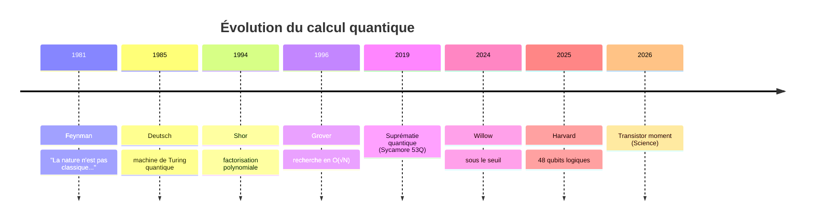

```mermaid
graph TD
    P1[Partie I<br/>Fondements] --> C1[Ch 1-2 : Math & Postulats]
    P1 --> C2[Ch 3 : Portes & Circuits]
    P1 --> C3[Ch 4 : Densité & Bruit]
    P2[Partie II<br/>Algorithmes] --> C4[Ch 5 : Deutsch-Jozsa, Simon]
    P2 --> C5[Ch 6 : QFT, QPE]
    P2 --> C6[Ch 7 : Shor, Crypto]
    P2 --> C7[Ch 8 : Grover]
    P3[Partie III<br/>Correction d'erreur] --> C8[Ch 9 : Motivation, Codes]
    P3 --> C9[Ch 10 : Surface, QLDPC]
    P3 --> C10[Ch 11 : Tolérance, 2024-26]
    P4[Partie IV<br/>Matériel] --> C11[Ch 12 : Supraconducteurs, Atomes]
    P4 --> C12[Ch 13 : Topologiques, Photoniques]
    P4 --> C13[Ch 14 : Applications, Défis]
```

# Chapitre 1.1 — Introduction historique et panorama

## Objectifs

- Comprendre la transition du calcul classique au calcul quantique
- Situer les jalons historiques clés
- Appréhender la boucle de rétroaction physique–information
- Connaître l'état de l'art 2024–2026

---

## Vue d'ensemble

```
                    QUANTUM COMPUTING ENGINEERING
                    ═══════════════════════════════
                                          
   Physique               Information        
   ────────               ───────────        
   • Mécanique Q   ←──→   • Qubits           
   • Hamiltoniens         • Circuits         
   • Cohérence/T₁,T₂      • Algorithmes      
   • Mesure               • Probabilités     
                                          
              ┌─────────────────┐            
              │ Calcul Quantique │            
              │   Quantique      │            
              └────────┬────────┘            
                       │                     
        ┌──────────────┼──────────────┐      
        │              │              │      
    ┌───▼───┐    ┌─────▼─────┐   ┌────▼────┐
    │ Bit   │ →  │   Qubit   │ → │  2^n   │  
    │ {0,1} │    │ α|0⟩+β|1⟩ │   │ états  │  
    └───────┘    └───────────┘   └─────────┘
```

---

## 1. Des machines de Turing au modèle quantique

### 1.1 Calcul classique

Une machine de Turing manipule des **bits** : états $0$ ou $1$. Tout calcul classique se ramène à des opérations élémentaires sur ces bits via des portes logiques (ET, OU, NON).

**Limite fondamentale :** Pour certains problèmes (factorisation, simulation quantique), le temps de calcul croît exponentiellement avec la taille de l'entrée.

### 1.2 Naissance de l'idée quantique

| Année | Jalon |
|-------|-------|
| 1981 | **R. Feynman** propose d'utiliser des systèmes quantiques pour simuler la physique quantique |
| 1985 | **D. Deutsch** formalise la machine de Turing quantique universelle |
| 1994 | **P. Shor** : algorithme de factorisation en temps polynomial |
| 1996 | **L. Grover** : algorithme de recherche en $O(\sqrt{N})$ |
| 1998 | Premier système à 2 qubits |
| 2019 | Suprématie quantique (Google Sycamore, 53 qubits) |
| 2024 | **Google Willow** : réduction exponentielle des erreurs sous le seuil |
| 2025 | **Harvard** : processeur logique à 48 qubits tolérants aux fautes |
| 2025 | **Microsoft Majorana 1** : premier qubit topologique |
| 2026 | « Transistor moment » du quantique (Science, 2026) |



---

## 2. La boucle de rétroaction physique–information

Le calcul quantique repose sur une idée profonde :

> L'information est physique — et la physique est informationnelle.

- Les bits classiques sont abstraits ; les qubits sont des **systèmes physiques réels**
- Pour calculer, il faut **contrôler la physique** à l'échelle microscopique
- Réciproquement, l'information quantique permet de **simuler la physique**

$$
\text{Physique} \xrightleftharpoons[\text{simulation}]{\text{implémentation}} \text{Information}
$$

Cette boucle est au cœur de la **seconde révolution quantique**.

---

## 3. Pourquoi le calcul quantique ?

### 3.1 Accélération pour certains problèmes

| Problème | Classique | Quantique |
|----------|-----------|-----------|
| Factorisation d'un entier $N$ | $O(e^{1.9 (\log N)^{1/3} (\log \log N)^{2/3}})$ | $O((\log N)^3)$ |
| Recherche non-structurée | $O(N)$ | $O(\sqrt{N})$ |
| Simulation de $n$ spins | $O(2^n)$ | $O(\text{poly}(n))$ |

### 3.2 Intrication et parallélisme

Le parallélisme quantique n'est pas du parallélisme classique : un registre de $n$ qubits peut être dans une **superposition cohérente** de $2^n$ états simultanément.

$$
\ket{\psi} = \sum_{i=0}^{2^n-1} \alpha_i \ket{i}, \quad \sum_i |\alpha_i|^2 = 1
$$

où $\ket{\psi}$ = état du registre de $n$ qubits, $\alpha_i \in \mathbb{C}$ = amplitude de probabilité de l'état de base $\ket{i}$ (avec $i$ en binaire), $|\alpha_i|^2$ = probabilité de mesurer $\ket{i}$

Cependant, la mesure projette sur un seul état : l'art des algorithmes quantiques est d'**amplifier les amplitudes des états d'intérêt** avant la mesure.

---

## 4. État de l'art 2024–2026

### 4.1 Processeurs quantiques

| Acteur | Processeur | Qubits | Technologie | Fidélité |
|--------|------------|--------|-------------|----------|
| Google | Willow | 105 | Supraconducteur | 99,97 % |
| IBM | Condor | 433 | Supraconducteur | — |
| Microsoft | Majorana 1 | 8 (logiques) | Topologique | Prototype |
| Harvard/QuEra | — | 48 logiques | Atomes neutres | Tolérant aux fautes |
| Oxford Ionics | — | — | Ions piégés | 99,99 % |

### 4.2 Correction d'erreur

- **Google Willow (2024)** : passage sous le seuil de correction d'erreur pour les codes de surface
- **Harvard (2025)** : premier processeur logique universel avec 48 qubits logiques
- **QuEra (2025)** : algorithmic fault tolerance (AFT) réduisant le surcoût temporel

### 4.3 Perspectives

- **2027–2029** : avantage quantique pratique (utile pour l'industrie)
- **2030+** : ordinateur quantique tolérant aux fautes à grande échelle
- Marché : \$1,4 G (2025) → projection \$72–100 G d'ici 2035

---

## 5. Organisation du cours

```
Partie I  : Fondements      (Chapitres 1–4)   — Mathématiques, physique, circuits
Partie II : Algorithmes     (Chapitres 5–8)   — Deutsch–Jozsa, QFT, Shor, Grover
Partie III: Correction d'erreur (Chapitres 9–11) — Codes, surface, tolérance
Partie IV : Matériel & Perspectives (Chapitres 12–14) — Hardware, applications
```



Chaque séance combine :
1. **Fondement théorique** — formalisme mathématique
2. **Démonstration Python** — simulation physique (QuTiP) ou circuit (Qiskit)
3. **Analyse et interprétation**

---

## 6. Pour aller plus loin

- [NC00] Nielsen & Chuang, *Quantum Computation and Quantum Information*, Ch. 1
- [Aar13] Aaronson, *Quantum Computing Since Democritus*, Ch. 1–3
- [Sci26] « Quantum technology has reached its transistor moment », *Science*, 2026
- Vidéo : [Quantum Computing for Computer Scientists](https://www.youtube.com/watch?v=F_Riqjdh2oM)

---

## Exercices

1. Lister 3 problèmes où un ordinateur quantique pourrait offrir un avantage par rapport à un ordinateur classique.
2. Expliquer en 2–3 phrases pourquoi la mesure est une opération destructive en quantique.
3. Lire la section 1 de [NC00] et résumer les 5 jalons les plus importants selon vous.
