# Chapitre 2.2 — Superposition, intrication et concepts clés

## Objectifs

- Distinguer superposition et mélange statistique
- Comprendre et générer des états intriqués
- Violer les inégalités de Bell en simulation
- Connaître les théorèmes de non-clonage et non-signalement

---

## Vue d'ensemble

```
     Bit classique          Qubit (superposition)        Intrication (2 qubits)
     ═════════════          ═════════════════════         ══════════════════════

       ┌─────┐                   ┌─────────┐                ┌──────────────┐
       │     │                   │         │                │  |0⟩ ─┐      │
       │  0  │  ou               │  α|0⟩+  │                │  |1⟩ ─┤ Bell │
       │     │                   │   β|1⟩   │                │       │      │
       └─────┘                   └─────────┘                │  |0⟩ ─┤      │
                                                           │  |1⟩ ─┘      │
       ┌─────┐                                              └──────────────┘
       │     │
       │  1  │  (mutuellement                         Mesure sur A
       │     │   exclusifs)                           ────► résultat
       └─────┘                                              │
                                                           Mesure sur B
                                                           ────► toujours
                                                          corrélé à A
```

---

## 1. Superposition quantique

### 1.1 Principe de superposition

Contrairement à un bit classique qui est soit $0$, soit $1$, un qubit peut être dans une **combinaison linéaire** :

$$
\ket{\psi} = \alpha\ket{0} + \beta\ket{1}
$$

où $\alpha, \beta \in \mathbb{C}$ sont des amplitudes avec $|\alpha|^2 + |\beta|^2 = 1$

C'est la **ressource fondamentale** du calcul quantique : un registre de $n$ qubits peut coder $2^n$ valeurs en parallèle.

### 1.2 Interférence quantique

Les amplitudes $\alpha, \beta$ peuvent interférer constructivement ou destructivement :

$$
\ket{+} = \frac{\ket{0} + \ket{1}}{\sqrt{2}}, \quad
\ket{-} = \frac{\ket{0} - \ket{1}}{\sqrt{2}}
$$

où $\ket{+} = $ superposition symétrique, $\ket{-} = $ superposition antisymétrique (phase relative $-1$)

Application d'une Hadamard :

$$
H\ket{0} = \ket{+}, \quad H\ket{1} = \ket{-}, \quad H\ket{+} = \ket{0}
$$

L'interférence est au cœur des algorithmes quantiques.

---

## 2. Intrication quantique

### 2.1 États séparables vs intriqués

Un état $\ket{\psi}_{AB}$ est **séparable** s'il peut s'écrire :

$$
\ket{\psi}_{AB} = \ket{\phi}_A \otimes \ket{\chi}_B
$$

Sinon, il est **intriqué** (ou enchevêtré).

### 2.2 États de Bell (EPR)

Les états de Bell sont les états maximaux intriqués à 2 qubits :

$$
\begin{aligned}
\ket{\Phi^+} &= \frac{1}{\sqrt{2}}(\ket{00} + \ket{11}) \\
\ket{\Phi^-} &= \frac{1}{\sqrt{2}}(\ket{00} - \ket{11}) \\
\ket{\Psi^+} &= \frac{1}{\sqrt{2}}(\ket{01} + \ket{10}) \\
\ket{\Psi^-} &= \frac{1}{\sqrt{2}}(\ket{01} - \ket{10})
\end{aligned}
$$

où les 4 états de Bell forment une base orthonormée de l'espace $\mathbb{C}^2 \otimes \mathbb{C}^2$

**Circuit de création d'un état de Bell** $\ket{\Phi^+}$ :

```mermaid
graph LR
    A["|0⟩"] --> H["H"] --> B["•"]
    C["|0⟩"] --> D["⊕"]
    B --> E["|Φ+⟩ = (|00⟩+|11⟩)/√2"]
    D --> E
    style H fill:#1f77b4,color:#fff
    style B fill:#000
    style D fill:#fff,stroke:#000
    style E fill:#90EE90
```



### 2.3 Propriétés

- **Non-séparabilité** : impossible d'écrire $\ket{\Phi^+} = \ket{\phi}_A \otimes \ket{\chi}_B$
- **Corrélations parfaites** : si on mesure les deux qubits dans la base $Z$, les résultats sont identiques (pour $\ket{\Phi^+}$)
- **Non-localité** : viol des inégalités de Bell

```python
import qutip as qt

# États de Bell avec QuTiP
ket00 = qt.tensor(qt.basis(2,0), qt.basis(2,0))
ket11 = qt.tensor(qt.basis(2,1), qt.basis(2,1))
ket01 = qt.tensor(qt.basis(2,0), qt.basis(2,1))
ket10 = qt.tensor(qt.basis(2,1), qt.basis(2,0))

phi_plus = (ket00 + ket11).unit()
phi_minus = (ket00 - ket11).unit()
psi_plus = (ket01 + ket10).unit()
psi_minus = (ket01 - ket10).unit()

print("|Φ⁺⟩ :", phi_plus)
```

**Sortie attendue :**

```
|Φ⁺⟩ : Quantum object: dims=[[2, 2], [1]], shape=(4, 1), type='ket', dtype=Dense
Qobj data =
[[0.70710678]
 [0.        ]
 [0.        ]
 [0.70710678]]
```

---

## 3. Inégalités de Bell

### 3.1 Contexte

Einstein, Podolsky et Rosen (1935) ont argumenté que la MQ était incomplète (« action fantôme à distance »). Bell (1964) a montré qu'aucune **théorie à variables cachées locales** ne peut reproduire toutes les prédictions de la MQ.

### 3.2 Jeu CHSH

Le test CHSH (Clauser–Horne–Shimony–Holt) est une version pratique des inégalités de Bell.

A et B reçoivent chacun un bit ($x, y \in \{0,1\}$) et doivent produire des bits de sortie ($a, b \in \{0,1\}$) tels que :

$$
a \oplus b = x \land y
$$

**Borne classique :** $p_{\text{succès}} \leq 3/4$ (ou $S \leq 2$)

**Borne quantique :** $p_{\text{succès}} = \cos^2(\pi/8) \approx 0.854$ (ou $S = 2\sqrt{2}$)

### 3.3 Implémentation CHSH

```python
import numpy as np
import qutip as qt

# État initial |Φ⁺⟩
ket00 = qt.tensor(qt.basis(2,0), qt.basis(2,0))
ket11 = qt.tensor(qt.basis(2,1), qt.basis(2,1))
psi = (ket00 + ket11).unit()

# Mesures selon des angles différents
def mesure_CHSH(psi, theta_A, theta_B):
    """Mesure avec des angles theta_A et theta_B pour A et B."""
    # Opérateur de mesure pour A : cos(θ_A) Z + sin(θ_A) X
    op_A = np.cos(theta_A) * qt.sigmaz() + np.sin(theta_A) * qt.sigmax()
    op_B = np.cos(theta_B) * qt.sigmaz() + np.sin(theta_B) * qt.sigmax()

    # Opérateur composite
    op = qt.tensor(op_A, op_B)
    return qt.expect(op, psi)

# Choix d'angles pour CHSH
angles = [
    (0, np.pi/4),      # a=0, b=0
    (0, 3*np.pi/4),    # a=0, b=1
    (np.pi/2, np.pi/4), # a=1, b=0
    (np.pi/2, 3*np.pi/4), # a=1, b=1
]

signes = [1, -1, 1, 1]  # S = E(a,b) - E(a,b') + E(a',b) + E(a',b')
S = sum(s * mesure_CHSH(psi, thA, thB)
        for s, (thA, thB) in zip(signes, angles))
print(f"Valeur de S (classique ≤ 2) : {S:.4f}")
print(f"Borne quantique : {2*np.sqrt(2):.4f}")
```

**Sortie attendue :**

```
Valeur de S (classique ≤ 2) : 2.8284
Borne quantique : 2.8284
```

---

## 4. Théorème de non-clonage

> Il est impossible de copier parfaitement un état quantique inconnu.

**Preuve :** Supposons une machine $U$ qui clone : $U\ket{\psi}\ket{0} = \ket{\psi}\ket{\psi}$ pour tout $\ket{\psi}$. Alors pour $\ket{\psi}$ et $\ket{\phi}$ :

$$
U(\alpha\ket{\psi} + \beta\ket{\phi})\ket{0} = \alpha\ket{\psi}\ket{\psi} + \beta\ket{\phi}\ket{\phi}
$$

mais par linéarité, on devrait avoir $\alpha\ket{\psi}\ket{\psi} + \beta\ket{\phi}\ket{\psi} + \alpha\ket{\psi}\ket{\phi} + \beta\ket{\phi}\ket{\phi}$, ce qui est différent. Contradiction.

**Conséquences :**
- Pas de backup en quantique
- La cryptographie quantique est possible (BB84)
- Le codage superdense et la téléportation sont possibles

---

## 5. Théorème de non-signalement

> L'intrication ne permet pas de transmettre de l'information plus vite que la lumière.

**Preuve :** La matrice densité réduite $\rho_A = \text{Tr}_B(\rho_{AB})$ ne dépend pas des mesures effectuées sur $B$.

```python
# Vérification du non-signalement
psi_phi_plus = (ket00 + ket11).unit()
rho_AB = psi_phi_plus * psi_phi_plus.dag()

# Matrice densité réduite de A
rho_A = rho_AB.ptrace(0)
print("ρ_A =", rho_A)
# ρ_A = I/2, indépendant de toute mesure sur B
```

**Sortie attendue :**

```
ρ_A = Quantum object: dims=[[2], [2]], shape=(2, 2), type='oper', dtype=CSR, isherm=True
Qobj data =
[[0.5 0. ]
 [0.  0.5]]
```

---

## 6. Résumé des concepts clés

| Concept | Description | Conséquence |
|---------|-------------|-------------|
| **Superposition** | Combinaison linéaire d'états | Parallélisme quantique |
| **Intrication** | Corrélations non-classiques | Viol de Bell, téléportation |
| **Interférence** | Addition d'amplitudes | Amplification des états voulus |
| **Non-clonage** | Pas de copie parfaite | Sécurité QKD |
| **Non-signalement** | Pas de FTL | Causalité préservée |

---

## Exercices

1. Vérifier que $\ket{\Phi^+} = (\ket{00} + \ket{11})/\sqrt{2}$ ne peut pas s'écrire comme un produit tensoriel.
2. Calculer $S$ pour l'état $\ket{\Phi^-}$ dans le jeu CHSH.
3. Implémenter la mesure CHSH avec Qiskit (circuit quantique) au lieu de QuTiP.
4. Montrer que l'état $\ket{\Psi^-} = (\ket{01} - \ket{10})/\sqrt{2}$ est invariant sous toute rotation unitaire identique sur les deux qubits : $(U \otimes U)\ket{\Psi^-} = \ket{\Psi^-}$.
5. Le protocole BB84 : expliquer pourquoi le non-clonage le rend sécurisé.
