# Chapitre 2.2 — Superposition, intrication et concepts clés

## Ce que vous allez apprendre

- Distinguer superposition quantique et mélange statistique (une différence fondamentale !)
- Comprendre et générer des états intriqués (états de Bell)
- Simuler la violation des inégalités de Bell (le jeu CHSH)
- Maîtriser les théorèmes de non-clonage et non-signalement
- Voir pourquoi ces concepts sont les ressources du calcul quantique

---

## Motivation

Dans le chapitre 2.1, nous avons appris les 4 postulats. Mais quels sont les **phénomènes** qui rendent le quantique si spécial ? Trois mots : **superposition**, **intrication**, **interférence**.

La superposition permet à un qubit d'être « dans deux états à la fois ». L'intrication crée des corrélations entre qubits qui défient l'intuition classique. L'interférence permet d'amplifier les bonnes réponses et d'annuler les mauvaises.

Ces concepts ne sont pas que de la curiosité théorique : ce sont les **ressources** qui alimentent les algorithmes quantiques. Sans eux, pas de Shor, pas de Grover, pas de téléportation. Ce chapitre vous donne l'intuition profonde de chacun.

---

## Idée principale

**Superposition** — Imaginez une pièce de monnaie qui tourne en l'air. Tant qu'elle tourne, elle n'est ni pile ni face : elle est « les deux à la fois ». Ce n'est pas que vous ne savez pas — c'est que la pièce est réellement dans un état intermédiaire. Quand elle retombe (la mesure), elle « choisit » pile ou face.

**Intrication** — Imaginez deux pièces magiques, une à Paris et une à Tokyo. Vous les faites tourner simultanément. Quand elles s'arrêtent, elles montrent TOUJOURS le même côté, même si elles sont séparées par des milliers de kilomètres. Ce n'est pas qu'elles étaient programmées à l'avance — c'est prouvé par les inégalités de Bell !

**Interférence** — Comme des vagues sur l'eau : deux vagues peuvent s'additionner (interférence constructive) ou s'annuler (interférence destructive). Les algorithmes quantiques utilisent ce principe pour amplifier la bonne réponse.

---

## Contenu du cours

### Section 1 : Superposition quantique

#### 1.1 Principe de superposition

Contrairement à un bit classique qui est soit $0$, soit $1$, un qubit peut être dans une **combinaison linéaire** :

$$\ket{\psi} = \alpha\ket{0} + \beta\ket{1}$$

où $\alpha, \beta \in \mathbb{C}$ sont des amplitudes avec $|\alpha|^2 + |\beta|^2 = 1$

> **Intuition :** Ce n'est PAS « soit 0 soit 1, on ne sait pas lequel ». C'est un **troisième état** à part entière, qui a des propriétés différentes de $\ket{0}$ ET de $\ket{1}$. C'est la **ressource fondamentale** du calcul quantique : un registre de $n$ qubits peut coder $2^n$ valeurs en parallèle.

**Avez-vous compris ?**
- L'état $\frac{1}{\sqrt{2}}(\ket{0} + \ket{1})$ est-il en superposition ? (Oui)
- L'état $\ket{0}$ est-il en superposition ? (Non, c'est un état de base)

#### 1.2 Interférence quantique

Les amplitudes $\alpha, \beta$ peuvent interférer constructivement ou destructivement :

$$\ket{+} = \frac{\ket{0} + \ket{1}}{\sqrt{2}}, \quad \ket{-} = \frac{\ket{0} - \ket{1}}{\sqrt{2}}$$

où $\ket{+} = $ superposition symétrique, $\ket{-} = $ superposition antisymétrique (phase relative $-1$)

> **Intuition :** Dans $\ket{+}$, les deux amplitudes sont du même signe → elles s'additionnent « en phase ». Dans $\ket{-}$, elles sont de signes opposés → elles interfèrent « en opposition de phase ». Cette différence de phase n'a aucun effet sur les probabilités de mesure dans la base Z (50/50 dans les deux cas), mais elle a des effets DRAMATIQUES quand on mesure dans d'autres bases.

Application d'une Hadamard :

$$H\ket{0} = \ket{+}, \quad H\ket{1} = \ket{-}, \quad H\ket{+} = \ket{0}$$

> **Exemple d'interférence :** Appliquons $H$ à $\ket{-}$ :
> $$H\ket{-} = H\left(\frac{\ket{0} - \ket{1}}{\sqrt{2}}\right) = \frac{H\ket{0} - H\ket{1}}{\sqrt{2}} = \frac{\ket{+} - \ket{-}}{\sqrt{2}}$$
> $$= \frac{1}{\sqrt{2}}\left(\frac{\ket{0}+\ket{1}}{\sqrt{2}} - \frac{\ket{0}-\ket{1}}{\sqrt{2}}\right) = \frac{1}{2}(2\ket{1}) = \ket{1}$$
> L'amplitude de $\ket{0}$ s'est **annulée** par interférence destructive ! C'est le mécanisme clé des algorithmes quantiques.

L'interférence est au cœur des algorithmes quantiques.

---

### Section 2 : Intrication quantique

#### 2.1 États séparables vs intriqués

Un état $\ket{\psi}_{AB}$ est **séparable** s'il peut s'écrire :

$$\ket{\psi}_{AB} = \ket{\phi}_A \otimes \ket{\chi}_B$$

> **Intuition :** Un état séparable, c'est comme deux pièces indépendantes : on peut décrire l'état de chaque pièce séparément. Un état intriqué, c'est quand c'est IMPOSSIBLE — les deux qubits forment un tout indissociable.

Sinon, il est **intriqué** (ou enchevêtré).

#### 2.2 États de Bell (EPR)

Les états de Bell sont les états maximaux intriqués à 2 qubits :

$$\begin{aligned}
\ket{\Phi^+} &= \frac{1}{\sqrt{2}}(\ket{00} + \ket{11}) \\
\ket{\Phi^-} &= \frac{1}{\sqrt{2}}(\ket{00} - \ket{11}) \\
\ket{\Psi^+} &= \frac{1}{\sqrt{2}}(\ket{01} + \ket{10}) \\
\ket{\Psi^-} &= \frac{1}{\sqrt{2}}(\ket{01} - \ket{10})
\end{aligned}$$

où les 4 états de Bell forment une base orthonormée de l'espace $\mathbb{C}^2 \otimes \mathbb{C}^2$

> **Intuition pour $\ket{\Phi^+}$ :** Si vous mesurez le premier qubit et obtenez 0, le second sera AUSSI 0. Si vous obtenez 1, le second sera 1. Les résultats sont parfaitement corrélés, même si chaque résultat individuel est totalement aléatoire (50/50).

**Circuit de création d'un état de Bell** $\ket{\Phi^+}$ :

```mermaid
graph LR
    A["|0⟩"] --> H["H"] --> B["•"]
    C["|0⟩"] --> D["⊕"]
    B --> E["|Φ+⟩ = (|00⟩+|11⟩)/√2"]
    D --> E
    style H fill:#1f77b4,color:#fff
    style B fill:#000
    style D fill:#fff,stroke:#000
    style E fill:#90EE90
```



> **Comment ça marche :**
> 1. $H$ sur le premier qubit : $\ket{0} \to \ket{+} = \frac{1}{\sqrt{2}}(\ket{0} + \ket{1})$
> 2. CNOT (contrôle=qubit 1, cible=qubit 2) : $\frac{1}{\sqrt{2}}(\ket{0}\ket{0} + \ket{1}\ket{1}) = \ket{\Phi^+}$

#### 2.3 Propriétés

- **Non-séparabilité** : impossible d'écrire $\ket{\Phi^+} = \ket{\phi}_A \otimes \ket{\chi}_B$
- **Corrélations parfaites** : si on mesure les deux qubits dans la base $Z$, les résultats sont identiques (pour $\ket{\Phi^+}$)
- **Non-localité** : viol des inégalités de Bell

```python
import qutip as qt

# --- Création des états de base à 2 qubits ---
# qt.tensor() calcule le produit tensoriel
ket00 = qt.tensor(qt.basis(2,0), qt.basis(2,0))  # |00⟩
ket11 = qt.tensor(qt.basis(2,1), qt.basis(2,1))  # |11⟩
ket01 = qt.tensor(qt.basis(2,0), qt.basis(2,1))  # |01⟩
ket10 = qt.tensor(qt.basis(2,1), qt.basis(2,0))  # |10⟩

# --- Les 4 états de Bell ---
phi_plus  = (ket00 + ket11).unit()  # |Φ⁺⟩ = (|00⟩ + |11⟩)/√2
phi_minus = (ket00 - ket11).unit()  # |Φ⁻⟩ = (|00⟩ - |11⟩)/√2
psi_plus  = (ket01 + ket10).unit()  # |Ψ⁺⟩ = (|01⟩ + |10⟩)/√2
psi_minus = (ket01 - ket10).unit()  # |Ψ⁻⟩ = (|01⟩ - |10⟩)/√2

print("|Φ⁺⟩ :", phi_plus)
```

**Sortie attendue :**

```
|Φ⁺⟩ : Quantum object: dims=[[2, 2], [1]], shape=(4, 1), type='ket', dtype=Dense
Qobj data =
[[0.70710678]
 [0.        ]
 [0.        ]
 [0.70710678]]
```

> **Lecture du résultat :** Le vecteur a 4 composantes correspondant à $\ket{00}, \ket{01}, \ket{10}, \ket{11}$. Seules les composantes $\ket{00}$ et $\ket{11}$ sont non nulles, chacune avec amplitude $\frac{1}{\sqrt{2}} \approx 0.707$.

---

### Section 3 : Inégalités de Bell

#### 3.1 Contexte historique

Einstein, Podolsky et Rosen (1935) ont argumenté que la MQ était incomplète (« action fantôme à distance »). Selon eux, les corrélations s'expliquaient par des **variables cachées** : les particules emporteraient des instructions prédéterminées.

Bell (1964) a montré qu'aucune **théorie à variables cachées locales** ne peut reproduire toutes les prédictions de la MQ. C'est un résultat profond : l'intrication est une ressource genuinely quantique.

#### 3.2 Jeu CHSH

Le test CHSH (Clauser–Horne–Shimony–Holt) est une version pratique des inégalités de Bell.

> **Le jeu :** Alice et Bob reçoivent chacun un bit ($x, y \in \{0,1\}$) et doivent produire des bits de sortie ($a, b \in \{0,1\}$) tels que :

$$a \oplus b = x \land y$$

> **Intuition :** Alice et Bob doivent produire des bits qui satisfont une condition logique, sans communiquer. Classiquement, la meilleure stratégie gagne au plus 75% du temps. Quantiquement, avec un état intriqué, on peut gagner ~85.4% du temps !

**Borne classique :** $p_{\text{succès}} \leq 3/4$ (ou $S \leq 2$)

**Borne quantique :** $p_{\text{succès}} = \cos^2(\pi/8) \approx 0.854$ (ou $S = 2\sqrt{2}$)

> **Exemple numérique :** $2\sqrt{2} \approx 2.828 > 2$. La valeur quantique dépasse la borne classique de ~41%.

#### 3.3 Implémentation CHSH

```python
import numpy as np
import qutip as qt

# --- État initial |Φ⁺⟩ ---
ket00 = qt.tensor(qt.basis(2,0), qt.basis(2,0))
ket11 = qt.tensor(qt.basis(2,1), qt.basis(2,1))
psi = (ket00 + ket11).unit()

# --- Fonction de mesure CHSH ---
def mesure_CHSH(psi, theta_A, theta_B):
    """Calcule la valeur attendue <A⊗B> pour des angles donnés.
    
    Args:
        psi: état quantique à 2 qubits
        theta_A: angle de mesure pour Alice
        theta_B: angle de mesure pour Bob
    
    Returns:
        Valeur attendue de l'opérateur cos(θ_A)Z + sin(θ_A)X ⊗ cos(θ_B)Z + sin(θ_B)X
    """
    # Opérateur de mesure pour A : combinaison de Z et X selon l'angle θ_A
    op_A = np.cos(theta_A) * qt.sigmaz() + np.sin(theta_A) * qt.sigmax()
    # Opérateur de mesure pour B : idem avec θ_B
    op_B = np.cos(theta_B) * qt.sigmaz() + np.sin(theta_B) * qt.sigmax()

    # Opérateur composite A ⊗ B (produit tensoriel)
    op = qt.tensor(op_A, op_B)
    # Valeur attendue <ψ|A⊗B|ψ>
    return qt.expect(op, psi)

# --- Choix des angles optimaux pour CHSH ---
# Les angles optimaux sont : 0, π/4 pour A ; π/4, 3π/4 pour B
angles = [
    (0, np.pi/4),       # x=0, y=0
    (0, 3*np.pi/4),     # x=0, y=1
    (np.pi/2, np.pi/4), # x=1, y=0
    (np.pi/2, 3*np.pi/4), # x=1, y=1
]

# --- Calcul de S = E(a,b) - E(a,b') + E(a',b) + E(a',b') ---
signes = [1, -1, 1, 1]
S = sum(s * mesure_CHSH(psi, thA, thB)
        for s, (thA, thB) in zip(signes, angles))
print(f"Valeur de S (classique ≤ 2) : {S:.4f}")
print(f"Borne quantique : {2*np.sqrt(2):.4f}")
```

**Sortie attendue :**

```
Valeur de S (classique ≤ 2) : 2.8284
Borne quantique : 2.8284
```

> **Interprétation :** $S = 2\sqrt{2} \approx 2.828$ dépasse la borne classique $S \leq 2$. La mécanique quantique viole les inégalités de Bell ! Cela confirme que les corrélations de l'intrication ne peuvent pas être expliquées par des variables cachées locales.

---

### Section 4 : Théorème de non-clonage

> **Théorème :** Il est impossible de copier parfaitement un état quantique inconnu.

> **Intuition :** En classique, vous copiez un fichier en un clic. En quantique, c'est **physiquement impossible**. Ce n'est pas une limitation technologique — c'est une loi fondamentale de la nature.

**Preuve :** Supposons une machine $U$ qui clone : $U\ket{\psi}\ket{0} = \ket{\psi}\ket{\psi}$ pour tout $\ket{\psi}$. Alors pour $\ket{\psi}$ et $\ket{\phi}$ :

$$U(\alpha\ket{\psi} + \beta\ket{\phi})\ket{0} = \alpha\ket{\psi}\ket{\psi} + \beta\ket{\phi}\ket{\phi}$$

mais par linéarité, on devrait avoir :

$$\alpha\ket{\psi}\ket{\psi} + \beta\ket{\phi}\ket{\psi} + \alpha\ket{\psi}\ket{\phi} + \beta\ket{\phi}\ket{\phi}$$

ce qui est différent. Contradiction. $\square$

> **Explication intuitive :** Le problème vient du fait que le clonage devrait produire des termes croisés ($\ket{\psi}\ket{\phi}$ et $\ket{\phi}\ket{\psi}$) que la linéarité de la mécanique quantique ne permet pas de créer.

**Conséquences :**
- Pas de backup en quantique (on ne peut pas sauvegarder un état inconnu)
- La cryptographie quantique est possible (BB84) — un espion ne peut pas copier les qubits
- Le codage superdense et la téléportation sont possibles

---

### Section 5 : Théorème de non-signalement

> **Théorème :** L'intrication ne permet pas de transmettre de l'information plus vite que la lumière.

> **Intuition :** Même si Alice et Bob partagent un état intriqué et que les mesures sont corrélées, Alice ne peut pas CHOISIR le résultat de sa mesure. Donc elle ne peut pas encoder un message. Bob voit des résultats aléatoires, corrélés avec ceux d'Alice, mais il ne peut pas le savoir sans recevoir un message classique.

**Preuve :** La matrice densité réduite $\rho_A = \text{Tr}_B(\rho_{AB})$ ne dépend pas des mesures effectuées sur $B$.

```python
import qutip as qt

# --- Vérification du non-signalement ---
# On crée l'état |Φ⁺⟩
ket00 = qt.tensor(qt.basis(2,0), qt.basis(2,0))
ket11 = qt.tensor(qt.basis(2,1), qt.basis(2,1))
psi_phi_plus = (ket00 + ket11).unit()

# Matrice densité du système complet : ρ_AB = |Φ⁺⟩⟨Φ⁺|
rho_AB = psi_phi_plus * psi_phi_plus.dag()

# --- Trace partielle sur B pour obtenir ρ_A ---
# ptrace(0) trace sur le sous-système B (index 1)
rho_A = rho_AB.ptrace(0)
print("ρ_A =", rho_A)
# ρ_A = I/2 : état totalement mélangé, indépendant de toute mesure sur B
```

**Sortie attendue :**

```
ρ_A = Quantum object: dims=[[2], [2]], shape=(2, 2), type='oper', dtype=CSR, isherm=True
Qobj data =
[[0.5 0. ]
 [0.  0.5]]
```

> **Interprétation :** $\rho_A = I/2$ est l'état maximalement mélangé. Alice ne voit que du bruit aléatoire, quelle que soit la mesure que Bob fait de son côté. Pour extraire les corrélations, il faut que Bob envoie ses résultats par un canal classique (limité par la vitesse de la lumière).

---

## Exemple guidé

**Problème :** Vérifier que $\ket{\Phi^+} = (\ket{00} + \ket{11})/\sqrt{2}$ est intriqué (non séparable).

**Étape 1 — Supposons par l'absurde qu'il est séparable :**

$$\ket{\Phi^+} = (a\ket{0} + b\ket{1}) \otimes (c\ket{0} + d\ket{1})$$

**Étape 2 — Développons le produit tensoriel :**

$$= ac\ket{00} + ad\ket{01} + bc\ket{10} + bd\ket{11}$$

**Étape 3 — Identifions avec $\ket{\Phi^+} = \frac{1}{\sqrt{2}}\ket{00} + 0\ket{01} + 0\ket{10} + \frac{1}{\sqrt{2}}\ket{11}$ :**

- $ac = \frac{1}{\sqrt{2}}$
- $ad = 0$
- $bc = 0$
- $bd = \frac{1}{\sqrt{2}}$

**Étape 4 — Cherchons une contradiction :**

De $ad = 0$ : soit $a = 0$, soit $d = 0$.
- Si $a = 0$ : alors $ac = 0 \neq \frac{1}{\sqrt{2}}$. Contradiction !
- Si $d = 0$ : alors $bd = 0 \neq \frac{1}{\sqrt{2}}$. Contradiction !

**Conclusion :** $\ket{\Phi^+}$ n'est PAS séparable. Il est intriqué. $\square$

---

## Implémentation Python

### Résumé des concepts clés en code

```python
import numpy as np
import qutip as qt

# ============================================================
# 1. SUPERPOSITION : créer et manipuler des états superposés
# ============================================================
ket0 = qt.basis(2, 0)
ket1 = qt.basis(2, 1)

# État |+⟩ : superposition symétrique
ket_plus = (ket0 + ket1).unit()
# État |-⟩ : superposition antisymétrique (phase relative π)
ket_minus = (ket0 - ket1).unit()

print("Superposition |+⟩ :", ket_plus)
print("Superposition |-⟩ :", ket_minus)

# ============================================================
# 2. INTERFÉRENCE : H appliqué à |+⟩ redonne |0⟩
# ============================================================
H = (1/np.sqrt(2)) * qt.Qobj([[1, 1], [1, -1]])
result = H * ket_plus  # Devrait redonner |0⟩
print("\nH|+⟩ =", result)  # = |0⟩ (interférence constructive sur |0⟩)

result2 = H * ket_minus  # Devrait redonner |1⟩
print("H|-⟩ =", result2)  # = |1⟩ (interférence destructive sur |0⟩)

# ============================================================
# 3. INTRICATION : état de Bell |Φ⁺⟩
# ============================================================
ket00 = qt.tensor(ket0, ket0)
ket11 = qt.tensor(ket1, ket1)
phi_plus = (ket00 + ket11).unit()
print("\n|Φ⁺⟩ =", phi_plus)

# ============================================================
# 4. NON-CLONAGE : on ne peut pas copier un état inconnu
# ============================================================
# Vérifions que le CNOT ne clone PAS une superposition
CNOT = qt.Qobj(np.array([[1,0,0,0],[0,1,0,0],[0,0,0,1],[0,0,1,0]]),
               dims=[[2,2],[2,2]])

# CNOT clone |0⟩ → |00⟩ et |1⟩ → |11⟩ (comme un copieur classique)
print("\nCNOT|00⟩ =", CNOT * ket00)  # |00⟩ ✓
print("CNOT|10⟩ =", CNOT * qt.tensor(ket1, ket0))  # |11⟩ ✓

# Mais CNOT ne clone PAS |+⟩ !
psi_in = qt.tensor(ket_plus, ket0)
result_cnot = CNOT * psi_in
print("CNOT(|+⟩⊗|0⟩) =", result_cnot)  # État intriqué, PAS |+⟩⊗|+⟩ !

# ============================================================
# 5. NON-SIGNALEMENT : ρ_A = I/2 pour |Φ⁺⟩
# ============================================================
rho_AB = phi_plus * phi_plus.dag()
rho_A = rho_AB.ptrace(0)
print("\nρ_A (trace partielle de |Φ⁺⟩) =", rho_A)
print("→ État maximalement mélangé : aucune info transmise par B")
```

---

## À retenir

1. **Superposition** : un qubit peut être dans une combinaison linéaire $\alpha\ket{0} + \beta\ket{1}$ — c'est un état à part entière, pas de l'ignorance
2. **Intrication** : des qubits peuvent avoir des corrélations plus fortes que ce que permet la physique classique (états de Bell)
3. **Interférence** : les amplitudes s'additionnent ou s'annulent — c'est le moteur des algorithmes quantiques
4. **Non-clonage** : on ne peut pas copier un état quantique inconnu → sécurité de la cryptographie quantique
5. **Non-signalement** : l'intrication ne transmet pas d'information plus vite que la lumière → la causalité est sauvée
6. **Bell/CHSH** : $S = 2\sqrt{2} > 2$ prouve que les variables cachées locales sont insuffisantes
7. **États de Bell** : 4 états maximalement intriqués qui forment une base de $\mathbb{C}^2 \otimes \mathbb{C}^2$

---

## Pièges à éviter

1. **« La superposition c'est juste de l'ignorance »** — NON. Un état comme $\ket{+}$ a des propriétés physiques mesurables différentes de « soit $\ket{0}$, soit $\ket{1}$ ». L'expérience des fentes de Young le prouve.

2. **« L'intrication permet de communiquer instantanément »** — FAUX. Le théorème de non-signalement l'interdit. Les corrélations existent, mais ne peuvent pas transmettre un message sans canal classique.

3. **Confondre $\ket{\Phi^+}$ et un mélange classique 50/50** — $\ket{\Phi^+} = (\ket{00}+\ket{11})/\sqrt{2}$ donne des corrélations qui violent Bell. Un mélange 50% $\ket{00}$ + 50% $\ket{11}$ ne les viole pas.

4. **Penser que le non-clonage est une limitation technologique** — C'est un théorème mathématique, pas une limitation d'ingénierie. Aucune technologie future ne pourra le contourner.

5. **Oublier que les 4 états de Bell forment une base** — On peut mesurer dans la base de Bell, ce qui est crucial pour la téléportation et le codage superdense.

---

## Exercices

### Niveau 1 — Application directe

1. Vérifier que $\ket{\Phi^+} = (\ket{00} + \ket{11})/\sqrt{2}$ ne peut pas s'écrire comme un produit tensoriel.
   *(Suivez l'exemple guidé ci-dessus !)*

2. Calculer $H\ket{+}$ et $H\ket{-}$ en utilisant la matrice de Hadamard. Vérifier que $H^2 = I$.

3. Écrire les 4 états de Bell sous forme de vecteurs colonnes dans la base $\{\ket{00}, \ket{01}, \ket{10}, \ket{11}\}$.

### Niveau 2 — Compréhension

4. Calculer $S$ pour l'état $\ket{\Phi^-}$ dans le jeu CHSH. Obtient-on aussi $2\sqrt{2}$ ?

5. Montrer que l'état $\ket{\Psi^-} = (\ket{01} - \ket{10})/\sqrt{2}$ est invariant sous toute rotation unitaire identique sur les deux qubits : $(U \otimes U)\ket{\Psi^-} = \ket{\Psi^-}$.
   *(Indice : commencez par vérifier pour $U = X$, $U = Z$, puis généralisez)*

6. Le protocole BB84 : expliquer pourquoi le non-clonage le rend sécurisé.
   *(Indice : si un espion Eve intercepte un qubit, elle ne peut pas le copier sans le perturber...)*

### Niveau 3 — Défi

7. Implémenter la mesure CHSH avec Qiskit (circuit quantique) au lieu de QuTiP. Comparer les résultats avec la prédiction théorique.

8. Démontrer le théorème de non-clonage de manière rigoureuse en partant de l'hypothèse d'une transformation unitaire $U$ telle que $U\ket{\psi}\ket{0} = \ket{\psi}\ket{\psi}$ pour deux états non orthogonaux $\ket{\psi}$ et $\ket{\phi}$.

---

## Pour aller plus loin

- Vidéo : [Bell's Theorem](https://www.youtube.com/watch?v=zcqZHYo7ONH) — Explication visuelle des inégalités de Bell
- Aspect, A., Dalibard, J., & Roger, G. (1982). *Experimental realization of Einstein-Podolsky-Rosen-Bohm Gedankenexperiment* — L'expérience historique
- Nielsen & Chuang, Ch. 2.1.5-2.1.6 — Traitement formel de l'intrication et du non-clonage
